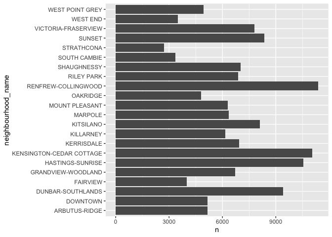
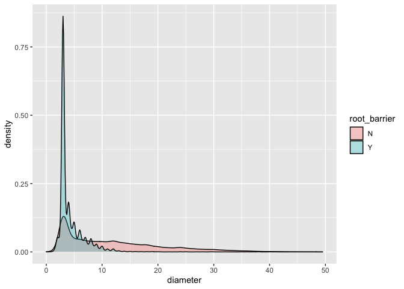

Mini data analysis
================
Mathias Delhaye

# Introduction

After installing the *datateachr* package in the R terminal, load the
packages *datateachr* and *tidyverse* for data exploration

# Task1: choosing my favorite dataset

**1. Choosing 4 data sets based on their descrition**

1: *steam_games*

2: *cancer_sample*

3: *vancouver_trees*

4: *apt_buildings*

**2. Exploring the data sets**

Let’s explore the datasets

``` r
dim(steam_games)
```

    ## [1] 40833    21

``` r
glimpse(steam_games)
```

    ## Rows: 40,833
    ## Columns: 21
    ## $ id                       <dbl> 1, 2, 3, 4, 5, 6, 7, 8, 9, 10, 11, 12, 13, 14…
    ## $ url                      <chr> "https://store.steampowered.com/app/379720/DO…
    ## $ types                    <chr> "app", "app", "app", "app", "app", "bundle", …
    ## $ name                     <chr> "DOOM", "PLAYERUNKNOWN'S BATTLEGROUNDS", "BAT…
    ## $ desc_snippet             <chr> "Now includes all three premium DLC packs (Un…
    ## $ recent_reviews           <chr> "Very Positive,(554),- 89% of the 554 user re…
    ## $ all_reviews              <chr> "Very Positive,(42,550),- 92% of the 42,550 u…
    ## $ release_date             <chr> "May 12, 2016", "Dec 21, 2017", "Apr 24, 2018…
    ## $ developer                <chr> "id Software", "PUBG Corporation", "Harebrain…
    ## $ publisher                <chr> "Bethesda Softworks,Bethesda Softworks", "PUB…
    ## $ popular_tags             <chr> "FPS,Gore,Action,Demons,Shooter,First-Person,…
    ## $ game_details             <chr> "Single-player,Multi-player,Co-op,Steam Achie…
    ## $ languages                <chr> "English,French,Italian,German,Spanish - Spai…
    ## $ achievements             <dbl> 54, 37, 128, NA, NA, NA, 51, 55, 34, 43, 72, …
    ## $ genre                    <chr> "Action", "Action,Adventure,Massively Multipl…
    ## $ game_description         <chr> "About This Game Developed by id software, th…
    ## $ mature_content           <chr> NA, "Mature Content Description  The develope…
    ## $ minimum_requirements     <chr> "Minimum:,OS:,Windows 7/8.1/10 (64-bit versio…
    ## $ recommended_requirements <chr> "Recommended:,OS:,Windows 7/8.1/10 (64-bit ve…
    ## $ original_price           <dbl> 19.99, 29.99, 39.99, 44.99, 0.00, NA, 59.99, …
    ## $ discount_price           <dbl> 14.99, NA, NA, NA, NA, 35.18, 70.42, 17.58, N…

``` r
class(steam_games)
```

    ## [1] "spec_tbl_df" "tbl_df"      "tbl"         "data.frame"

For this data set, the fact that there is the price as well as chain of
characters variables is interesting for data exploring, and it is a
tibble, making it easy to analyze

``` r
dim(cancer_sample)
```

    ## [1] 569  32

``` r
glimpse(cancer_sample)
```

    ## Rows: 569
    ## Columns: 32
    ## $ ID                      <dbl> 842302, 842517, 84300903, 84348301, 84358402, …
    ## $ diagnosis               <chr> "M", "M", "M", "M", "M", "M", "M", "M", "M", "…
    ## $ radius_mean             <dbl> 17.990, 20.570, 19.690, 11.420, 20.290, 12.450…
    ## $ texture_mean            <dbl> 10.38, 17.77, 21.25, 20.38, 14.34, 15.70, 19.9…
    ## $ perimeter_mean          <dbl> 122.80, 132.90, 130.00, 77.58, 135.10, 82.57, …
    ## $ area_mean               <dbl> 1001.0, 1326.0, 1203.0, 386.1, 1297.0, 477.1, …
    ## $ smoothness_mean         <dbl> 0.11840, 0.08474, 0.10960, 0.14250, 0.10030, 0…
    ## $ compactness_mean        <dbl> 0.27760, 0.07864, 0.15990, 0.28390, 0.13280, 0…
    ## $ concavity_mean          <dbl> 0.30010, 0.08690, 0.19740, 0.24140, 0.19800, 0…
    ## $ concave_points_mean     <dbl> 0.14710, 0.07017, 0.12790, 0.10520, 0.10430, 0…
    ## $ symmetry_mean           <dbl> 0.2419, 0.1812, 0.2069, 0.2597, 0.1809, 0.2087…
    ## $ fractal_dimension_mean  <dbl> 0.07871, 0.05667, 0.05999, 0.09744, 0.05883, 0…
    ## $ radius_se               <dbl> 1.0950, 0.5435, 0.7456, 0.4956, 0.7572, 0.3345…
    ## $ texture_se              <dbl> 0.9053, 0.7339, 0.7869, 1.1560, 0.7813, 0.8902…
    ## $ perimeter_se            <dbl> 8.589, 3.398, 4.585, 3.445, 5.438, 2.217, 3.18…
    ## $ area_se                 <dbl> 153.40, 74.08, 94.03, 27.23, 94.44, 27.19, 53.…
    ## $ smoothness_se           <dbl> 0.006399, 0.005225, 0.006150, 0.009110, 0.0114…
    ## $ compactness_se          <dbl> 0.049040, 0.013080, 0.040060, 0.074580, 0.0246…
    ## $ concavity_se            <dbl> 0.05373, 0.01860, 0.03832, 0.05661, 0.05688, 0…
    ## $ concave_points_se       <dbl> 0.015870, 0.013400, 0.020580, 0.018670, 0.0188…
    ## $ symmetry_se             <dbl> 0.03003, 0.01389, 0.02250, 0.05963, 0.01756, 0…
    ## $ fractal_dimension_se    <dbl> 0.006193, 0.003532, 0.004571, 0.009208, 0.0051…
    ## $ radius_worst            <dbl> 25.38, 24.99, 23.57, 14.91, 22.54, 15.47, 22.8…
    ## $ texture_worst           <dbl> 17.33, 23.41, 25.53, 26.50, 16.67, 23.75, 27.6…
    ## $ perimeter_worst         <dbl> 184.60, 158.80, 152.50, 98.87, 152.20, 103.40,…
    ## $ area_worst              <dbl> 2019.0, 1956.0, 1709.0, 567.7, 1575.0, 741.6, …
    ## $ smoothness_worst        <dbl> 0.1622, 0.1238, 0.1444, 0.2098, 0.1374, 0.1791…
    ## $ compactness_worst       <dbl> 0.6656, 0.1866, 0.4245, 0.8663, 0.2050, 0.5249…
    ## $ concavity_worst         <dbl> 0.71190, 0.24160, 0.45040, 0.68690, 0.40000, 0…
    ## $ concave_points_worst    <dbl> 0.26540, 0.18600, 0.24300, 0.25750, 0.16250, 0…
    ## $ symmetry_worst          <dbl> 0.4601, 0.2750, 0.3613, 0.6638, 0.2364, 0.3985…
    ## $ fractal_dimension_worst <dbl> 0.11890, 0.08902, 0.08758, 0.17300, 0.07678, 0…

``` r
class(cancer_sample)
```

    ## [1] "spec_tbl_df" "tbl_df"      "tbl"         "data.frame"

This data set is interesting, as all of the variables are numerical, the
dimensions are not that big and it is a tibble

``` r
dim(vancouver_trees)
```

    ## [1] 146611     20

``` r
glimpse(vancouver_trees)
```

    ## Rows: 146,611
    ## Columns: 20
    ## $ tree_id            <dbl> 149556, 149563, 149579, 149590, 149604, 149616, 149…
    ## $ civic_number       <dbl> 494, 450, 4994, 858, 5032, 585, 4909, 4925, 4969, 7…
    ## $ std_street         <chr> "W 58TH AV", "W 58TH AV", "WINDSOR ST", "E 39TH AV"…
    ## $ genus_name         <chr> "ULMUS", "ZELKOVA", "STYRAX", "FRAXINUS", "ACER", "…
    ## $ species_name       <chr> "AMERICANA", "SERRATA", "JAPONICA", "AMERICANA", "C…
    ## $ cultivar_name      <chr> "BRANDON", NA, NA, "AUTUMN APPLAUSE", NA, "CHANTICL…
    ## $ common_name        <chr> "BRANDON ELM", "JAPANESE ZELKOVA", "JAPANESE SNOWBE…
    ## $ assigned           <chr> "N", "N", "N", "Y", "N", "N", "N", "N", "N", "N", "…
    ## $ root_barrier       <chr> "N", "N", "N", "N", "N", "N", "N", "N", "N", "N", "…
    ## $ plant_area         <chr> "N", "N", "4", "4", "4", "B", "6", "6", "3", "3", "…
    ## $ on_street_block    <dbl> 400, 400, 4900, 800, 5000, 500, 4900, 4900, 4900, 7…
    ## $ on_street          <chr> "W 58TH AV", "W 58TH AV", "WINDSOR ST", "E 39TH AV"…
    ## $ neighbourhood_name <chr> "MARPOLE", "MARPOLE", "KENSINGTON-CEDAR COTTAGE", "…
    ## $ street_side_name   <chr> "EVEN", "EVEN", "EVEN", "EVEN", "EVEN", "ODD", "ODD…
    ## $ height_range_id    <dbl> 2, 4, 3, 4, 2, 2, 3, 3, 2, 2, 2, 5, 3, 2, 2, 2, 2, …
    ## $ diameter           <dbl> 10.00, 10.00, 4.00, 18.00, 9.00, 5.00, 15.00, 14.00…
    ## $ curb               <chr> "N", "N", "Y", "Y", "Y", "Y", "Y", "Y", "Y", "Y", "…
    ## $ date_planted       <date> 1999-01-13, 1996-05-31, 1993-11-22, 1996-04-29, 19…
    ## $ longitude          <dbl> -123.1161, -123.1147, -123.0846, -123.0870, -123.08…
    ## $ latitude           <dbl> 49.21776, 49.21776, 49.23938, 49.23469, 49.23894, 4…

``` r
class(vancouver_trees)
```

    ## [1] "tbl_df"     "tbl"        "data.frame"

For this data set, several variables are numeric which is good to do
analysis, it is a tibble and it has the neighborhood name

``` r
dim(apt_buildings)
```

    ## [1] 3455   37

``` r
glimpse(apt_buildings)
```

    ## Rows: 3,455
    ## Columns: 37
    ## $ id                               <dbl> 10359, 10360, 10361, 10362, 10363, 10…
    ## $ air_conditioning                 <chr> "NONE", "NONE", "NONE", "NONE", "NONE…
    ## $ amenities                        <chr> "Outdoor rec facilities", "Outdoor po…
    ## $ balconies                        <chr> "YES", "YES", "YES", "YES", "NO", "NO…
    ## $ barrier_free_accessibilty_entr   <chr> "YES", "NO", "NO", "YES", "NO", "NO",…
    ## $ bike_parking                     <chr> "0 indoor parking spots and 10 outdoo…
    ## $ exterior_fire_escape             <chr> "NO", "NO", "NO", "YES", "NO", NA, "N…
    ## $ fire_alarm                       <chr> "YES", "YES", "YES", "YES", "YES", "Y…
    ## $ garbage_chutes                   <chr> "YES", "YES", "NO", "NO", "NO", "NO",…
    ## $ heating_type                     <chr> "HOT WATER", "HOT WATER", "HOT WATER"…
    ## $ intercom                         <chr> "YES", "YES", "YES", "YES", "YES", "Y…
    ## $ laundry_room                     <chr> "YES", "YES", "YES", "YES", "YES", "Y…
    ## $ locker_or_storage_room           <chr> "NO", "YES", "YES", "YES", "NO", "YES…
    ## $ no_of_elevators                  <dbl> 3, 3, 0, 1, 0, 0, 0, 2, 4, 2, 0, 2, 2…
    ## $ parking_type                     <chr> "Underground Garage , Garage accessib…
    ## $ pets_allowed                     <chr> "YES", "YES", "YES", "YES", "YES", "Y…
    ## $ prop_management_company_name     <chr> NA, "SCHICKEDANZ BROS. PROPERTIES", N…
    ## $ property_type                    <chr> "PRIVATE", "PRIVATE", "PRIVATE", "PRI…
    ## $ rsn                              <dbl> 4154812, 4154815, 4155295, 4155309, 4…
    ## $ separate_gas_meters              <chr> "NO", "NO", "NO", "NO", "NO", "NO", "…
    ## $ separate_hydro_meters            <chr> "YES", "YES", "YES", "YES", "YES", "Y…
    ## $ separate_water_meters            <chr> "NO", "NO", "NO", "NO", "NO", "NO", "…
    ## $ site_address                     <chr> "65  FOREST MANOR RD", "70  CLIPPER R…
    ## $ sprinkler_system                 <chr> "YES", "YES", "NO", "YES", "NO", "NO"…
    ## $ visitor_parking                  <chr> "PAID", "FREE", "UNAVAILABLE", "UNAVA…
    ## $ ward                             <chr> "17", "17", "03", "03", "02", "02", "…
    ## $ window_type                      <chr> "DOUBLE PANE", "DOUBLE PANE", "DOUBLE…
    ## $ year_built                       <dbl> 1967, 1970, 1927, 1959, 1943, 1952, 1…
    ## $ year_registered                  <dbl> 2017, 2017, 2017, 2017, 2017, NA, 201…
    ## $ no_of_storeys                    <dbl> 17, 14, 4, 5, 4, 4, 4, 7, 32, 4, 4, 7…
    ## $ emergency_power                  <chr> "NO", "YES", "NO", "NO", "NO", "NO", …
    ## $ `non-smoking_building`           <chr> "YES", "NO", "YES", "YES", "YES", "NO…
    ## $ no_of_units                      <dbl> 218, 206, 34, 42, 25, 34, 14, 105, 57…
    ## $ no_of_accessible_parking_spaces  <dbl> 8, 10, 20, 42, 12, 0, 5, 1, 1, 6, 12,…
    ## $ facilities_available             <chr> "Recycling bins", "Green Bin / Organi…
    ## $ cooling_room                     <chr> "NO", "NO", "NO", "NO", "NO", "NO", "…
    ## $ no_barrier_free_accessible_units <dbl> 2, 0, 0, 42, 0, NA, 14, 0, 0, 1, 25, …

``` r
class(apt_buildings)
```

    ## [1] "tbl_df"     "tbl"        "data.frame"

This data set is also a tibble, with some numerical variable that can be
exploit and it is not that big.

**3. Narrowing down to 2**

Based on the exploration before, the 2 data sets that seem the most
promising are *cancer_samples* and *steam_games*

-   vancouver_trees: there is a lot of numerical variables as well as
    chains of characters, which analysis possible, not just correlation
    between numerical variable
-   steam_games: this data set is interesting explore some relation
    between prices and genre of the game, in order to use not just
    numerical variable, but also chains of characters. And I love video
    games x)

**4. Final decision**

I am going to choose the *vancouver_trees* data set, as it presents
variables that are numerical and chains of character that are short and
simple to analyze, contrary to *steam-games*, that presents few
numerical variable and the **chr** variables are very complex. For the
*vancouver_trees*, I am going to explore the relation between
physiological data of the trees (*diameter* and *height_range_id*) and
other variables, such as the location or the type of tree.

# Task2 exploring the chosen dataset

Let’s dive in the *vancouver_trees* data set to see what is interesting
to study!

-   Exercise 2

``` r
vancouver_trees%>%
  mutate(age = difftime(Sys.Date(), date_planted, units = "days")) ## adding a column with the age of each trees (in days)
```

    ## # A tibble: 146,611 × 21
    ##    tree_id civic_number std_street    genus_name species_name cultivar_name  
    ##      <dbl>        <dbl> <chr>         <chr>      <chr>        <chr>          
    ##  1  149556          494 W 58TH AV     ULMUS      AMERICANA    BRANDON        
    ##  2  149563          450 W 58TH AV     ZELKOVA    SERRATA      <NA>           
    ##  3  149579         4994 WINDSOR ST    STYRAX     JAPONICA     <NA>           
    ##  4  149590          858 E 39TH AV     FRAXINUS   AMERICANA    AUTUMN APPLAUSE
    ##  5  149604         5032 WINDSOR ST    ACER       CAMPESTRE    <NA>           
    ##  6  149616          585 W 61ST AV     PYRUS      CALLERYANA   CHANTICLEER    
    ##  7  149617         4909 SHERBROOKE ST ACER       PLATANOIDES  COLUMNARE      
    ##  8  149618         4925 SHERBROOKE ST ACER       PLATANOIDES  COLUMNARE      
    ##  9  149619         4969 SHERBROOKE ST ACER       PLATANOIDES  COLUMNARE      
    ## 10  149625          720 E 39TH AV     FRAXINUS   AMERICANA    AUTUMN APPLAUSE
    ## # … with 146,601 more rows, and 15 more variables: common_name <chr>,
    ## #   assigned <chr>, root_barrier <chr>, plant_area <chr>,
    ## #   on_street_block <dbl>, on_street <chr>, neighbourhood_name <chr>,
    ## #   street_side_name <chr>, height_range_id <dbl>, diameter <dbl>, curb <chr>,
    ## #   date_planted <date>, longitude <dbl>, latitude <dbl>, age <drtn>

I chose this exercise because I wanted to know the age of each trees, to
make correlation between this and other numerical variable such as the
**diameter** of the **height_range_id**, or even any other variable.

-   Exercise 7

``` r
vancouver_trees%>%
  group_by(neighbourhood_name)%>%
  summarise(n = n())%>% # I want to store the number of trees for each neighborhood
  ggplot(aes(neighbourhood_name,n)) +
  geom_col() +
  coord_flip() # I use the tibble created before to see the number of trees per neighborhood
```

<!-- -->

I chose this exercise because I found it interesting to determine the
number of trees per neighborhood, it’s a relation that can be useful in
the future. I could have use the streets or the blocks, but for me it
makes more sense to look at the neighborhoods because there is certainly
an inner tree politic per neighborhood, and not per street

-   Exercise 5

``` r
vancouver_trees%>%
  mutate(year_planted = format(date_planted, "%Y")) %>% #creating a new column with just the year when each tree was planted
  filter(year_planted<1996) #filtering to just take the trees planted before 1996
```

    ## # A tibble: 10,702 × 21
    ##    tree_id civic_number std_street    genus_name species_name cultivar_name  
    ##      <dbl>        <dbl> <chr>         <chr>      <chr>        <chr>          
    ##  1  149579         4994 WINDSOR ST    STYRAX     JAPONICA     <NA>           
    ##  2  149604         5032 WINDSOR ST    ACER       CAMPESTRE    <NA>           
    ##  3  149617         4909 SHERBROOKE ST ACER       PLATANOIDES  COLUMNARE      
    ##  4  149618         4925 SHERBROOKE ST ACER       PLATANOIDES  COLUMNARE      
    ##  5  149619         4969 SHERBROOKE ST ACER       PLATANOIDES  COLUMNARE      
    ##  6  149625          720 E 39TH AV     FRAXINUS   AMERICANA    AUTUMN APPLAUSE
    ##  7  149626          736 E 39TH AV     TILIA      EUCHLORA   X <NA>           
    ##  8  149636          812 E 39TH AV     TILIA      EUCHLORA   X <NA>           
    ##  9  149640         6968 SELKIRK ST    ACER       PLATANOIDES  COLUMNARE      
    ## 10  149646          505 E 16TH AV     HIBISCUS   SYRIACA      <NA>           
    ## # … with 10,692 more rows, and 15 more variables: common_name <chr>,
    ## #   assigned <chr>, root_barrier <chr>, plant_area <chr>,
    ## #   on_street_block <dbl>, on_street <chr>, neighbourhood_name <chr>,
    ## #   street_side_name <chr>, height_range_id <dbl>, diameter <dbl>, curb <chr>,
    ## #   date_planted <date>, longitude <dbl>, latitude <dbl>, year_planted <chr>

I chose this exercise because there is a lot of dates, and I wanted to
filter by a year to restrain my analysis. Tt could be interesting to
just look at some years, for example here before 1996.

By the way here, we can see that our tibble is 10,000 rows while the
original one is more than 100,000, meaning that it seems that more trees
were planted from 1996

\*Exercise 8

``` r
vancouver_trees%>%
  filter(diameter<50)%>% #filtering because I noticed most of the trees have a diameter below 50, and with this filter the visualization is better
  ggplot(aes(x = diameter)) + 
    geom_density(aes(fill = root_barrier), alpha = 0.3)
```

<!-- --> For this
last one, I wanted to check the relation between the diameter of trees
and if there were root barrier for the tree or not, which could affect
the growth of the tree.

# Task3: research questions

-   Question 1

What is the evolution of trees plantation with the years? Indeed, by
filtering with the year, I notice that I decreased the number of rows by
10, which may suggest a potential increase in the number of trees
planted

-   Question 2

How evolved the number of trees per neighborhood with the years? Indeed,
we can see variabilities in the number of trees per neighborhood, but
how did this evolve with time?

-   Question 3

With the variability in the number of trees per neighborhood, can we
also find some prevalence in some species for each neighborhood?

-   Question 4

Is there a relation between the age of the tree (the year) and the
species of the tree? So in other word, is there a trend in the type of
trees that are planted over the years?
