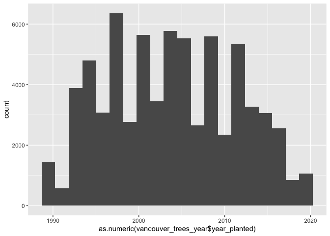
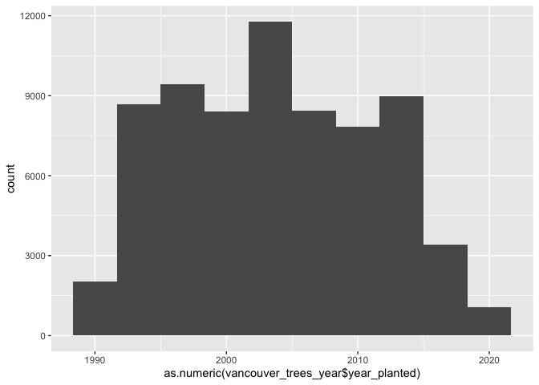
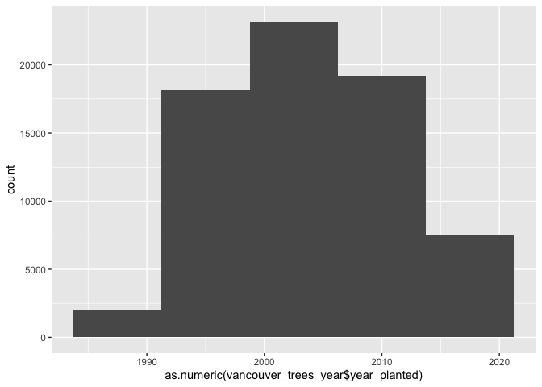
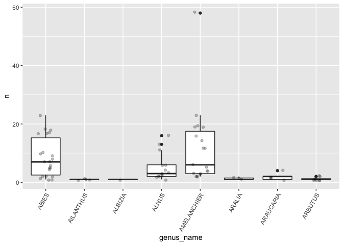
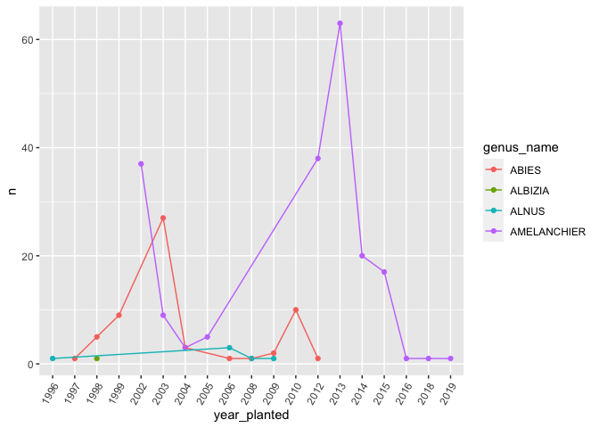
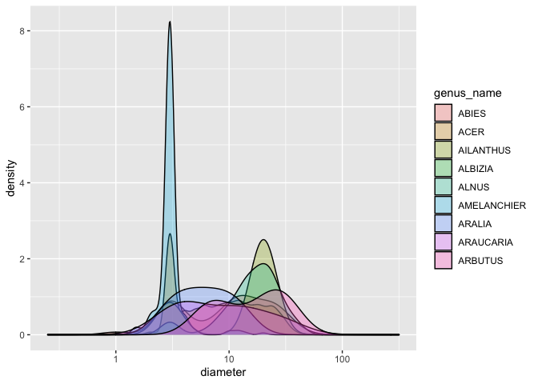

Mini Data Analysis Milestone 2
================
Mathias Delhaye

*To complete this milestone, you can either edit [this `.rmd`
file](https://raw.githubusercontent.com/UBC-STAT/stat545.stat.ubc.ca/master/content/mini-project/mini-project-2.Rmd)
directly. Fill in the sections that are commented out with
`<!--- start your work here--->`. When you are done, make sure to knit
to an `.md` file by changing the output in the YAML header to
`github_document`, before submitting a tagged release on canvas.*

# Welcome back to your mini data analysis project!

This time, we will explore more in depth the concept of *tidy data*, and
hopefully investigate further into your research questions that you
defined in milestone 1.

**NOTE**: The main purpose of the mini data analysis is to integrate
what you learn in class in an analysis. Although each milestone provides
a framework for you to conduct your analysis, it’s possible that you
might find the instructions too rigid for your data set. If this is the
case, you may deviate from the instructions – just make sure you’re
demonstrating a wide range of tools and techniques taught in this class.

Begin by loading your data and the tidyverse package below:

``` r
library(datateachr) # <- might contain the data you picked!
library(tidyverse)
```

# Learning Objectives

By the end of this milestone, you should:

-   Become familiar with manipulating and summarizing your data in
    tibbles using `dplyr` and `tidyr`, with a research question in mind.
-   Understand what *tidy* data is, and how to create it. In milestone
    3, we will explore when this might be useful.
-   Generate a reproducible and clear report using R Markdown.
-   Gain a greater understanding of how to use R to answer research
    questions about your data.

**Things to keep in mind**

-   Remember to document your code, be explicit about what you are
    doing, and write notes in this markdown document when you feel that
    context is required. Create your analysis as if someone else will be
    reading it! **There will be 2.5 points reserved for reproducibility,
    readability, and repo organization.**

-   Before working on each task, you should always keep in mind the
    specific **research question** that you’re trying to answer.

# Task 1: Process and summarize your data (15 points)

From milestone 1, you should have an idea of the basic structure of your
dataset (e.g. number of rows and columns, class types, etc.). Here, we
will start investigating your data more in-depth using various data
manipulation functions.

### 1.1 (2.5 points)

First, write out the 4 research questions you defined in milestone 1
were. This will guide your work through milestone 2:

<!-------------------------- Start your work below ---------------------------->

1.  *What is the evolution of trees plantation with the years?*
2.  *With the variability in the number of trees per neighborhood, can
    we also find some prevalence in some species for each neighborhood?*
3.  *Is there a trend in the type of trees that are planted over the
    years?*
4.  *Is there an evolution of the physiological properties of the trees
    (diameter and height), depending on the year? Are these properties
    related to any other variables of the tibble?*
    <!----------------------------------------------------------------------------->

### 1.2 (10 points)

Now, for each of your four research questions, choose one task from
options 1-4 (summarizing), and one other task from 4-8 (graphing). You
should have 2 tasks done for each research question (8 total). Make sure
it makes sense to do them! (e.g. don’t use a numerical variables for a
task that needs a categorical variable.). Comment on why each task helps
(or doesn’t!) answer the corresponding research question.

Ensure that the output of each operation is printed!

**Summarizing:**

1.  Compute the *range*, *mean*, and *two other summary statistics* of
    **one numerical variable** across the groups of **one categorical
    variable** from your data.
2.  Compute the number of observations for at least one of your
    categorical variables. Do not use the function `table()`!
3.  Create a categorical variable with 3 or more groups from an existing
    numerical variable. You can use this new variable in the other
    tasks! *An example: age in years into “child, teen, adult, senior”.*
4.  Based on two categorical variables, calculate two summary statistics
    of your choosing.

**Graphing:**

5.  Create a graph out of summarized variables that has at least two
    geom layers.
6.  Create a graph of your choosing, make one of the axes logarithmic,
    and format the axes labels so that they are “pretty” or easier to
    read.
7.  Make a graph where it makes sense to customize the alpha
    transparency.
8.  Create 3 histograms out of summarized variables, with each histogram
    having different sized bins. Pick the “best” one and explain why it
    is the best.

Make sure it’s clear what research question you are doing each operation
for!

<!------------------------- Start your work below ----------------------------->

*Question 1*: What is the evolution of trees plantation with the years?

First I want to determine the range of values for the years the trees
were planted. For that I am going to compute again the column with the
years planted.

``` r
vancouver_trees_year <- vancouver_trees%>%
  mutate(year_planted = format(date_planted, "%Y")) #creating a new column with just the year when each tree was planted
range(vancouver_trees_year$year_planted, na.rm = TRUE) #"na.rm = TRUE" needed to avoid NA
```

    ## [1] "1989" "2019"

So for this data set, the trees were planted from 1989 to 2019, so let’s
make 6 categories (**#3**): planted between 1989 and 1994, planted
between 1995 and 1999, planted between 2000 and 2004, planted between
2005 and 2010 planted between 2011 and 2015 and planted between 2016 and
2019.

``` r
vancouver_trees_yearcat <- vancouver_trees_year %>%
  mutate(plantation_period = case_when(year_planted<1995 ~ "1989-1994", #creating categorical variable indicating the period of plantation of the tree
                                       year_planted<2000 ~ "1995-1999",
                                       year_planted<2005 ~ "1999-2004",
                                       year_planted<2010 ~ "2005-2009",
                                       year_planted<2015 ~ "2010-2015",
                                       TRUE ~ "2016-2019",))
print(vancouver_trees_yearcat)
```

    ## # A tibble: 146,611 × 22
    ##    tree_id civic_number std_street    genus_name species_name cultivar_name  
    ##      <dbl>        <dbl> <chr>         <chr>      <chr>        <chr>          
    ##  1  149556          494 W 58TH AV     ULMUS      AMERICANA    BRANDON        
    ##  2  149563          450 W 58TH AV     ZELKOVA    SERRATA      <NA>           
    ##  3  149579         4994 WINDSOR ST    STYRAX     JAPONICA     <NA>           
    ##  4  149590          858 E 39TH AV     FRAXINUS   AMERICANA    AUTUMN APPLAUSE
    ##  5  149604         5032 WINDSOR ST    ACER       CAMPESTRE    <NA>           
    ##  6  149616          585 W 61ST AV     PYRUS      CALLERYANA   CHANTICLEER    
    ##  7  149617         4909 SHERBROOKE ST ACER       PLATANOIDES  COLUMNARE      
    ##  8  149618         4925 SHERBROOKE ST ACER       PLATANOIDES  COLUMNARE      
    ##  9  149619         4969 SHERBROOKE ST ACER       PLATANOIDES  COLUMNARE      
    ## 10  149625          720 E 39TH AV     FRAXINUS   AMERICANA    AUTUMN APPLAUSE
    ## # … with 146,601 more rows, and 16 more variables: common_name <chr>,
    ## #   assigned <chr>, root_barrier <chr>, plant_area <chr>,
    ## #   on_street_block <dbl>, on_street <chr>, neighbourhood_name <chr>,
    ## #   street_side_name <chr>, height_range_id <dbl>, diameter <dbl>, curb <chr>,
    ## #   date_planted <date>, longitude <dbl>, latitude <dbl>, year_planted <chr>,
    ## #   plantation_period <chr>

Like this, we can look at period of time instead of each year, which can
make more sense as the plantation politic from on year to another may
not be drastically different, but from one period to another yes.

We can also have a look at see using an histogram, with different number
of bins to group by period (**#8**)

``` r
vancouver_trees_year %>%
  ggplot(aes(as.numeric(vancouver_trees_year$year_planted))) +
    geom_histogram(bins = 20) #plotting the number of trees planted for each year
```

    ## Warning: Use of `vancouver_trees_year$year_planted` is discouraged. Use
    ## `year_planted` instead.

    ## Warning: Removed 76548 rows containing non-finite values (stat_bin).

<!-- -->

``` r
vancouver_trees_year %>%
  ggplot(aes(as.numeric(vancouver_trees_year$year_planted))) + 
    geom_histogram(bins = 10) #plotting the number of trees planted grouping by 2 years
```

    ## Warning: Use of `vancouver_trees_year$year_planted` is discouraged. Use
    ## `year_planted` instead.

    ## Warning: Removed 76548 rows containing non-finite values (stat_bin).

<!-- -->

``` r
vancouver_trees_year %>%
  ggplot(aes(as.numeric(vancouver_trees_year$year_planted))) + 
    geom_histogram(bins = 5) ##plotting the number of trees planted grouping by 4 years
```

    ## Warning: Use of `vancouver_trees_year$year_planted` is discouraged. Use
    ## `year_planted` instead.

    ## Warning: Removed 76548 rows containing non-finite values (stat_bin).

<!-- -->

Among the 3 graphs obtained, the graph with 10 bins gave the best
representation for me as we can clearly see the general tendency over
the years in the number of trees planted. With bin = 5, the observation
is not fine enough and with bin = 20, we observed a high variation from
one year to another but which may not really reflect the general
tendency over the years.

*Question 2*: With the variability in the number of trees per
neighborhood, can we also find some prevalence in some species for each
neighborhood?

For this one, we can summarize by the neighborhood and the type (genus)
of tree to look at the number for each combination of
neighborhood/tree(**#4**). We can include also the range of id tree to
have another statistic.

``` r
vancouver_trees_neighborhood_genus <- vancouver_trees %>%
  group_by(neighbourhood_name, genus_name) %>%
  summarize(n = n(), min_id = min(tree_id), max_id = max(tree_id)) # I want to store the number of trees for each neighborhood
```

    ## `summarise()` has grouped output by 'neighbourhood_name'. You can override using the `.groups` argument.

``` r
print(vancouver_trees_neighborhood_genus)
```

    ## # A tibble: 1,303 × 5
    ## # Groups:   neighbourhood_name [22]
    ##    neighbourhood_name genus_name      n min_id max_id
    ##    <chr>              <chr>       <int>  <dbl>  <dbl>
    ##  1 ARBUTUS-RIDGE      ABIES          18   7235 225364
    ##  2 ARBUTUS-RIDGE      ACER          867    967 265963
    ##  3 ARBUTUS-RIDGE      AESCULUS      134   2919 259849
    ##  4 ARBUTUS-RIDGE      AMELANCHIER    19  54679 264792
    ##  5 ARBUTUS-RIDGE      BETULA         77  17532 246760
    ##  6 ARBUTUS-RIDGE      CALOCEDRUS      1 204233 204233
    ##  7 ARBUTUS-RIDGE      CARPINUS      167    966 259551
    ##  8 ARBUTUS-RIDGE      CATALPA         5 154239 178612
    ##  9 ARBUTUS-RIDGE      CEDRUS         11  33674 258796
    ## 10 ARBUTUS-RIDGE      CELTIS          4 228229 228239
    ## # … with 1,293 more rows

With this, we directly obtain the number of trees for each genus
depending on the neighborhood, which almost answer the question.

Using this new tibble, we can plot the distribution of the number for
different genus per neighborhood to see if there are genus that present
more trees over all the neighborhood. Here we can look at just the genus
starting with A (removing ACER and AESCULUS because they are over
represented). We can use a boxplot and the distribution of point to
observe this (**#5&7**).

``` r
vancouver_trees_neighborhood_genus %>%
  filter(genus_name %in% c("ABIES", "AMELANCHIER", "ALNUS", "ARAUCARIA", "ARBUTUS", "ARALIA", "ALBIZIA", "AILANTHUS"))%>% #filtering by some genus name
  ggplot(aes(genus_name,n)) + #plotting the number of trees per neighborhood
    geom_boxplot()+
    geom_jitter(width = .2, alpha = .25) +
  theme(axis.text.x = element_text(angle = 60, hjust = 1))
```

<!-- --> We
can see here that ABIES, ALNUS and AMELANCHIER are the genus presenting
the higher number of trees, looking at the trees per neighborhood. We
could to this for every genus to see which one are the most represented
over all the neighborhoods

*Question 3*: Is there a trend in the type of trees that are planted
over the years?

First, let’s look at the number of each trees’ genus per year (**#2**)

``` r
vancouver_trees_year%>%
  group_by(genus_name, year_planted)%>% #grouping by the genus
  summarise(n = n()) #counting the number of observation
```

    ## `summarise()` has grouped output by 'genus_name'. You can override using the `.groups` argument.

    ## # A tibble: 1,146 × 3
    ## # Groups:   genus_name [97]
    ##    genus_name year_planted     n
    ##    <chr>      <chr>        <int>
    ##  1 ABIES      1997             1
    ##  2 ABIES      1998             5
    ##  3 ABIES      1999             9
    ##  4 ABIES      2003            27
    ##  5 ABIES      2004             3
    ##  6 ABIES      2006             1
    ##  7 ABIES      2008             1
    ##  8 ABIES      2009             2
    ##  9 ABIES      2010            10
    ## 10 ABIES      2012             1
    ## # … with 1,136 more rows

Going through the table quickly showed a high variability in the
representation of each genus, and variability in the number of trees for
each genus planted over time.

We can plot for some genus (one starting with A), the number of trees
planted for each year and to see the evolution (**#5**).

``` r
vancouver_trees_year%>%
  group_by(genus_name, year_planted)%>% #grouping by the genus
  summarise(n = n())%>%
  filter(genus_name %in% c("ABIES", "AMELANCHIER", "ALNUS", "ARAUCARIA", "ARBUTUS", "ARALIA", "ALBIZIA", "AILANTHUS"))%>%
  drop_na()%>%
  print()%>%
  ggplot(aes(year_planted,n)) +
          geom_point(aes(colour = genus_name)) +
          geom_line(aes(group = genus_name, colour = genus_name))+
  theme(axis.text.x = element_text(angle = 60, hjust = 1))
```

    ## `summarise()` has grouped output by 'genus_name'. You can override using the `.groups` argument.

    ## # A tibble: 26 × 3
    ## # Groups:   genus_name [4]
    ##    genus_name year_planted     n
    ##    <chr>      <chr>        <int>
    ##  1 ABIES      1997             1
    ##  2 ABIES      1998             5
    ##  3 ABIES      1999             9
    ##  4 ABIES      2003            27
    ##  5 ABIES      2004             3
    ##  6 ABIES      2006             1
    ##  7 ABIES      2008             1
    ##  8 ABIES      2009             2
    ##  9 ABIES      2010            10
    ## 10 ABIES      2012             1
    ## # … with 16 more rows

<!-- -->

We can see here that a lot of genus were dropped due to lack of
information on the year the trees were planted.

*Question 4*: Is there an evolution of the physiological properties of
the trees (diameter and height), depending on the year? Are these
properties related to any other variables of the tibble?

Let’s deep into the diameter variable, by grouping the data by the genus
of trees (**#1**) and looking at the mean, range, median and standard
deviation

``` r
vancouver_trees_genus_statdiameter <- vancouver_trees%>%
  group_by(genus_name)%>% #grouping by the genus
  summarise(mean_diameter = mean(diameter), min_diameter = min(diameter), max_diameter = max(diameter), median_diameter = median(diameter), sd_diameter = sd(diameter)) #calculating statistical summaries
print(vancouver_trees_genus_statdiameter)
```

    ## # A tibble: 97 × 6
    ##    genus_name  mean_diameter min_diameter max_diameter median_diameter
    ##    <chr>               <dbl>        <dbl>        <dbl>           <dbl>
    ##  1 ABIES               12.9             1         42.5           12   
    ##  2 ACER                10.6             0        317              8   
    ##  3 AESCULUS            23.7             0         64             25   
    ##  4 AILANTHUS           15.9             3         21.5           19.5 
    ##  5 ALBIZIA              6               6          6              6   
    ##  6 ALNUS               17.5             0         40             17.5 
    ##  7 AMELANCHIER          3.21            0         20              3   
    ##  8 ARALIA               6.81            3         12              6.12
    ##  9 ARAUCARIA           11.4             3         32              8.5 
    ## 10 ARBUTUS             18.4             6         33             17.5 
    ## # … with 87 more rows, and 1 more variable: sd_diameter <dbl>

Looking at the tibble made, the diameter of trees varies a lot depending
on the genus.

We can also look at the distribution of the diameter by selecting
specific genus (here again the ones starting with an A). I use a
logarithmic scale for it as well as I customize the alpha transparency
to make it easier to read (**#6,7**)

``` r
vancouver_trees%>%
  filter(genus_name %in% c("ABIES", "AMELANCHIER", "ALNUS","ACER", "ARAUCARIA", "ARBUTUS", "ARALIA", "ALBIZIA", "AILANTHUS"))%>%
  ggplot(aes(x = diameter))+
  geom_density(aes(fill = genus_name), alpha = 0.3)+
  scale_x_log10()
```

    ## Warning: Transformation introduced infinite values in continuous x-axis

    ## Warning: Removed 21 rows containing non-finite values (stat_density).

    ## Warning: Groups with fewer than two data points have been dropped.

    ## Warning in max(ids, na.rm = TRUE): no non-missing arguments to max; returning
    ## -Inf

<!-- --> Here
we have the visual representation that the diameter of the trees depends
a lot on the genus of that tree.

<!----------------------------------------------------------------------------->

### 1.3 (2.5 points)

Based on the operations that you’ve completed, how much closer are you
to answering your research questions? Think about what aspects of your
research questions remain unclear. Can your research questions be
refined, now that you’ve investigated your data a bit more? Which
research questions are yielding interesting results?

<!------------------------- Write your answer here ---------------------------->

For the 1st question, we have a fairly good idea of the evolution of the
tree plantation over the years, with an increase in the first 5 years,
to reach a plateau and then a decrease again in the last 4 years. For
the 2nd question, with the tibble, we obtained directly the answer to
our question, with the number of trees for each genus for each
neighborhood. For the 3rd question, it For the 4th question, we know the
diameter of the tree depends on the type of tree planted. We could
refine the question by looking at other factor that could influence the
diameter of the tree, and also look at which type of trees has the
biggest and smallest diameter.

The last question is the one that yield the most interesting results,
because we could go deeper in the analysis, while the other questions
don’t really allow to go deeper in their analysis.
<!----------------------------------------------------------------------------->

# Task 2: Tidy your data (12.5 points)

In this task, we will do several exercises to reshape our data. The goal
here is to understand how to do this reshaping with the `tidyr` package.

A reminder of the definition of *tidy* data:

-   Each row is an **observation**
-   Each column is a **variable**
-   Each cell is a **value**

*Tidy’ing* data is sometimes necessary because it can simplify
computation. Other times it can be nice to organize data so that it can
be easier to understand when read manually.

### 2.1 (2.5 points)

Based on the definition above, can you identify if your data is tidy or
untidy? Go through all your columns, or if you have \>8 variables, just
pick 8, and explain whether the data is untidy or tidy.

<!--------------------------- Start your work below --------------------------->

``` r
head(vancouver_trees)
```

    ## # A tibble: 6 × 20
    ##   tree_id civic_number std_street genus_name species_name cultivar_name  
    ##     <dbl>        <dbl> <chr>      <chr>      <chr>        <chr>          
    ## 1  149556          494 W 58TH AV  ULMUS      AMERICANA    BRANDON        
    ## 2  149563          450 W 58TH AV  ZELKOVA    SERRATA      <NA>           
    ## 3  149579         4994 WINDSOR ST STYRAX     JAPONICA     <NA>           
    ## 4  149590          858 E 39TH AV  FRAXINUS   AMERICANA    AUTUMN APPLAUSE
    ## 5  149604         5032 WINDSOR ST ACER       CAMPESTRE    <NA>           
    ## 6  149616          585 W 61ST AV  PYRUS      CALLERYANA   CHANTICLEER    
    ## # … with 14 more variables: common_name <chr>, assigned <chr>,
    ## #   root_barrier <chr>, plant_area <chr>, on_street_block <dbl>,
    ## #   on_street <chr>, neighbourhood_name <chr>, street_side_name <chr>,
    ## #   height_range_id <dbl>, diameter <dbl>, curb <chr>, date_planted <date>,
    ## #   longitude <dbl>, latitude <dbl>

This dataset looks tidy, as each row is an **observation**, each column
is a **variable** and each cell is a **value**. For example, *tree_id*
is a variable giving the id of each tree (the id is the value, unique
for each tree), with each row being a tree. For the variable
*neighbourhood_name*, each row is also an observation and each cell is a
value (the neighbourhood where the tree is). The *height_range_id* and
the *diameter* are tidy too, with each cell being the value for these
physiological parameter. Finally, for the *date_planted*, the
*longitude* and the *latitude*, we have also a value for each cell,
indicating respectively the date when the tree was planted, and the
coordinates.

Thus by definition, this dataset is tidy, with each column being a
variable, each row being an observation (tree) and each cell being a
value of these variables for each tree.
<!----------------------------------------------------------------------------->

### 2.2 (5 points)

Now, if your data is tidy, untidy it! Then, tidy it back to it’s
original state.

If your data is untidy, then tidy it! Then, untidy it back to it’s
original state.

Be sure to explain your reasoning for this task. Show us the “before”
and “after”.

<!--------------------------- Start your work below --------------------------->

``` r
untidy_vancouver_trees <- vancouver_trees %>%
  pivot_longer(cols = c(-tree_id, -civic_number, -std_street, -genus_name, -species_name, -cultivar_name, -common_name, -assigned, -root_barrier, -plant_area, -on_street_block, -on_street, -neighbourhood_name, -street_side_name, -curb, -date_planted, -longitude, -latitude), # select all the variable we want to keep
               names_to = "physiological_parameters", #gather the physiological parameter, height and diameter, in one variable
               values_to = "physiological_value")%>%#assigned variable to the value of this physiological data
  select(tree_id, physiological_parameters, physiological_value, everything())
print(untidy_vancouver_trees)
```

    ## # A tibble: 293,222 × 20
    ##    tree_id physiological_pa… physiological_v… civic_number std_street genus_name
    ##      <dbl> <chr>                        <dbl>        <dbl> <chr>      <chr>     
    ##  1  149556 height_range_id                  2          494 W 58TH AV  ULMUS     
    ##  2  149556 diameter                        10          494 W 58TH AV  ULMUS     
    ##  3  149563 height_range_id                  4          450 W 58TH AV  ZELKOVA   
    ##  4  149563 diameter                        10          450 W 58TH AV  ZELKOVA   
    ##  5  149579 height_range_id                  3         4994 WINDSOR ST STYRAX    
    ##  6  149579 diameter                         4         4994 WINDSOR ST STYRAX    
    ##  7  149590 height_range_id                  4          858 E 39TH AV  FRAXINUS  
    ##  8  149590 diameter                        18          858 E 39TH AV  FRAXINUS  
    ##  9  149604 height_range_id                  2         5032 WINDSOR ST ACER      
    ## 10  149604 diameter                         9         5032 WINDSOR ST ACER      
    ## # … with 293,212 more rows, and 14 more variables: species_name <chr>,
    ## #   cultivar_name <chr>, common_name <chr>, assigned <chr>, root_barrier <chr>,
    ## #   plant_area <chr>, on_street_block <dbl>, on_street <chr>,
    ## #   neighbourhood_name <chr>, street_side_name <chr>, curb <chr>,
    ## #   date_planted <date>, longitude <dbl>, latitude <dbl>

Here I untidied the data, by gathering the height and the diameter
together.

``` r
tidy_untidy_vancouver_trees <- untidy_vancouver_trees %>%
  pivot_wider(id_cols = c(-physiological_parameters, -physiological_value), #removing physiological_parameters and data
              names_from = physiological_parameters, #extracting the names from physiological_parameters
              values_from = physiological_value)%>% #assigning values via physiological_data
  select(tree_id, height_range_id,diameter, everything())
print(tidy_untidy_vancouver_trees)
```

    ## # A tibble: 146,611 × 20
    ##    tree_id height_range_id diameter civic_number std_street    genus_name
    ##      <dbl>           <dbl>    <dbl>        <dbl> <chr>         <chr>     
    ##  1  149556               2     10            494 W 58TH AV     ULMUS     
    ##  2  149563               4     10            450 W 58TH AV     ZELKOVA   
    ##  3  149579               3      4           4994 WINDSOR ST    STYRAX    
    ##  4  149590               4     18            858 E 39TH AV     FRAXINUS  
    ##  5  149604               2      9           5032 WINDSOR ST    ACER      
    ##  6  149616               2      5            585 W 61ST AV     PYRUS     
    ##  7  149617               3     15           4909 SHERBROOKE ST ACER      
    ##  8  149618               3     14           4925 SHERBROOKE ST ACER      
    ##  9  149619               2     16           4969 SHERBROOKE ST ACER      
    ## 10  149625               2      7.5          720 E 39TH AV     FRAXINUS  
    ## # … with 146,601 more rows, and 14 more variables: species_name <chr>,
    ## #   cultivar_name <chr>, common_name <chr>, assigned <chr>, root_barrier <chr>,
    ## #   plant_area <chr>, on_street_block <dbl>, on_street <chr>,
    ## #   neighbourhood_name <chr>, street_side_name <chr>, curb <chr>,
    ## #   date_planted <date>, longitude <dbl>, latitude <dbl>

<!----------------------------------------------------------------------------->

### 2.3 (5 points)

Now, you should be more familiar with your data, and also have made
progress in answering your research questions. Based on your interest,
and your analyses, pick 2 of the 4 research questions to continue your
analysis in milestone 3, and explain your decision.

Try to choose a version of your data that you think will be appropriate
to answer these 2 questions in milestone 3. Use between 4 and 8
functions that we’ve covered so far (i.e. by filtering, cleaning,
tidy’ing, dropping irrelvant columns, etc.).

<!--------------------------- Start your work below --------------------------->

The question I am choosing are the questions 2&3, *Is there a trend in
the type of trees that are planted over the years and per
neighborhood?*, and the question 4, *Is there an evolution of the
physiological properties of the trees (diameter and height), depending
on the year? Are these properties related to any other variables of the
tibble?*. I am choosing these questions because I haven’t fully answered
them yet, we can deep into more. And for the 1st question, I already
answered it with this document.

Let’s rearrange the data to prepare the answering of those questions

``` r
finalversion_vancouver_trees <- vancouver_trees %>%
  select(tree_id, genus_name, neighbourhood_name, height_range_id, diameter, date_planted) %>% #keeping only the data that are interesting
  mutate(year_planted = format(date_planted, "%Y"))%>% #adding the year planted
  arrange(genus_name, year_planted)%>% #re-ordering the data
  drop_na() #keeping only the rows without NA
head(finalversion_vancouver_trees)
```

    ## # A tibble: 6 × 7
    ##   tree_id genus_name neighbourhood_name height_range_id diameter date_planted
    ##     <dbl> <chr>      <chr>                        <dbl>    <dbl> <date>      
    ## 1   13223 ABIES      FAIRVIEW                         6       32 1997-04-15  
    ## 2  154263 ABIES      ARBUTUS-RIDGE                    2        3 1998-12-01  
    ## 3  178611 ABIES      ARBUTUS-RIDGE                    2        3 1998-12-01  
    ## 4  178643 ABIES      ARBUTUS-RIDGE                    2        3 1998-12-10  
    ## 5  178610 ABIES      ARBUTUS-RIDGE                    2        3 1998-12-01  
    ## 6  154261 ABIES      ARBUTUS-RIDGE                    2        3 1998-12-01  
    ## # … with 1 more variable: year_planted <chr>

<!----------------------------------------------------------------------------->

*When you are done, knit an `md` file. This is what we will mark! Make
sure to open it and check that everything has knitted correctly before
submitting your tagged release.*

### Attribution

Thanks to Victor Yuan for mostly putting this together.
